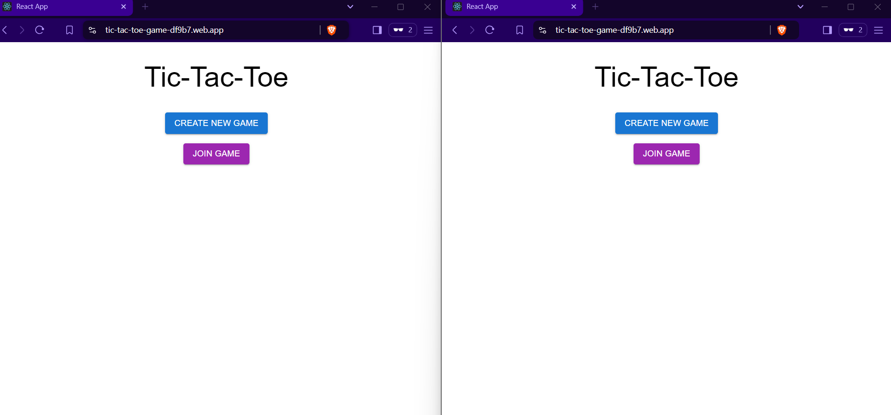
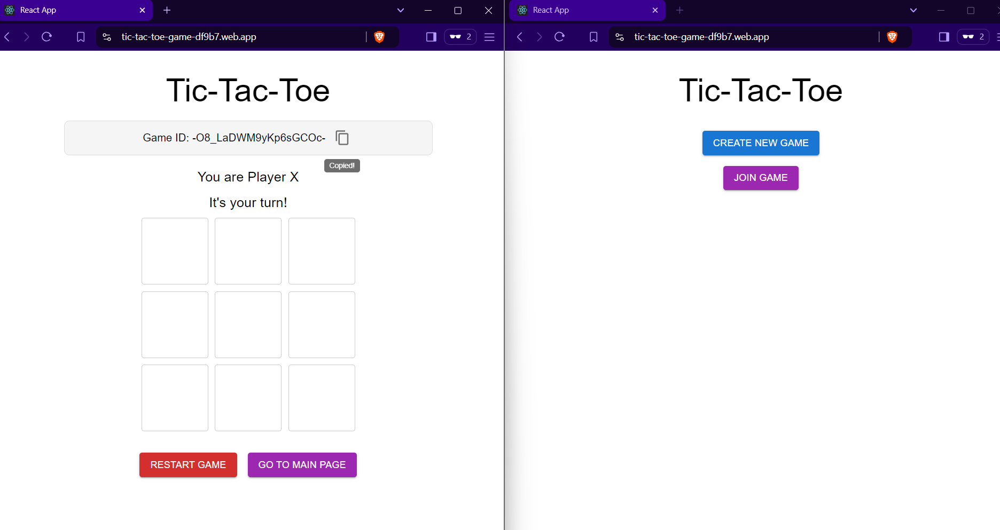
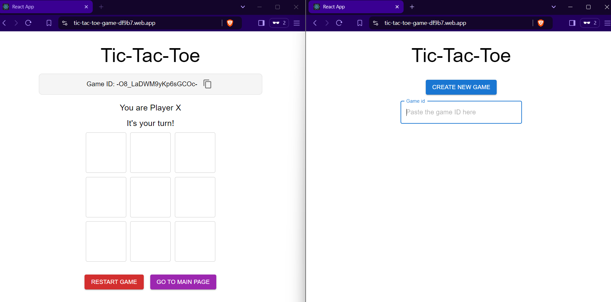
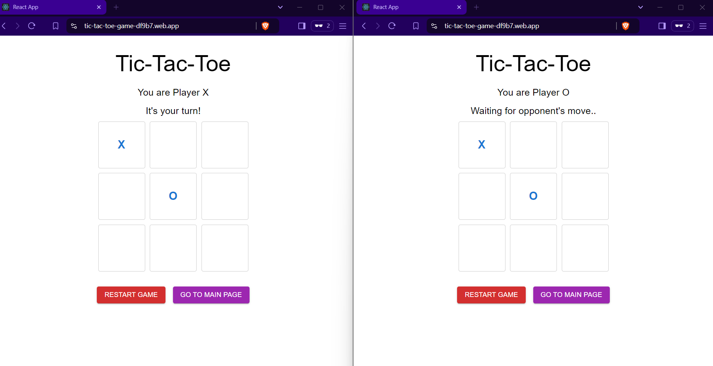
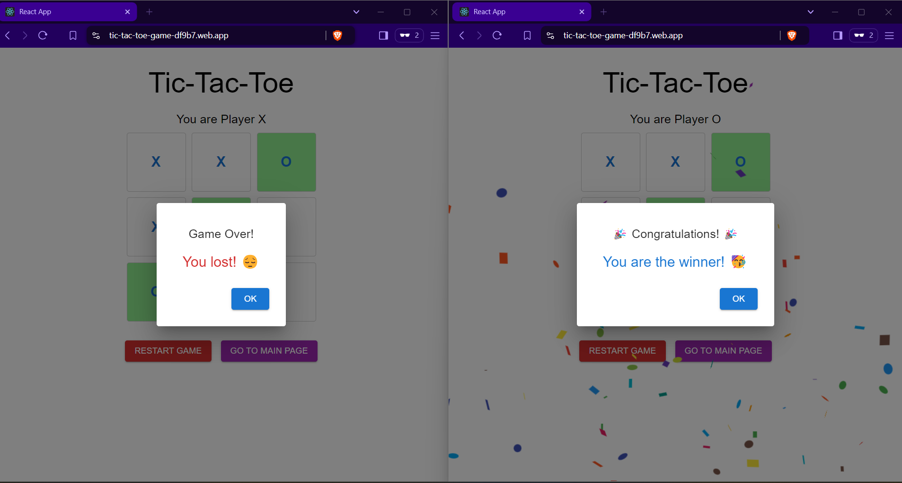

# Tic-Tac-Toe Game 🎮

A web-based Tic-Tac-Toe game built with **React**, **TypeScript**, and **Firebase** for real-time multiplayer support.

## LIVE : https://tic-tac-toe-game-df9b7.web.app/

## 🚀 Features

- Real-time multiplayer gameplay using Firebase Realtime Database.
- Dynamic UI with **Material-UI** components.
- Displays a congratulatory message for the winner with confetti animation.
- Friendly "Waiting for opponent's move..." message with animated dots.
- Support for restarting the game and going back to the main menu.
- Player roles displayed dynamically, ensuring clear indication of turns.

## 📚 Technologies Used

- **React**: Frontend library for building user interfaces.
- **TypeScript**: Type-safe JavaScript for better maintainability.
- **Material-UI**: Component library for a responsive and modern UI.
- **Firebase**: Realtime Database and Hosting for multiplayer functionality and deployment.

## 📦 Project Setup

1. **Clone the repository**:

   ```bash
   git clone https://github.com/sahinmeric/tic-tac-toe.git
   cd tic-tac-toe
   ```

2. **Install dependencies**:

   ```bash
   npm install
   ```

3. **Set up Firebase**:

   - Create a `.env` file at the root of your project and add your Firebase configuration:
     ```env
     REACT_APP_FIREBASE_API_KEY=your_api_key
     REACT_APP_FIREBASE_AUTH_DOMAIN=your_project_id.firebaseapp.com
     REACT_APP_FIREBASE_DATABASE_URL=https://your_project_id.firebaseio.com
     REACT_APP_FIREBASE_PROJECT_ID=your_project_id
     REACT_APP_FIREBASE_STORAGE_BUCKET=your_project_id.appspot.com
     REACT_APP_FIREBASE_MESSAGING_SENDER_ID=your_messaging_sender_id
     REACT_APP_FIREBASE_APP_ID=your_app_id
     ```

4. **Run the project**:

   ```bash
   npm start
   ```

   This will start the app in development mode. Open [http://localhost:3000](http://localhost:3000) to view it in the browser.

5. **Build and deploy**:
   - To build the project for production:
     ```bash
     npm run build
     ```
   - Deploy to Firebase:
     ```bash
     firebase deploy
     ```

## 🖥️ Deployment

The application is hosted using **Firebase Hosting**. You can access the live version of the app here: [Tic-tac-toe](https://tic-tac-toe-game-df9b7.web.app/).

## 📸 Screenshots

### Main Game Screen



### New Game



### Copying game id



### Join the game



### End game screen



## 🤝 Contributing

Contributions are welcome! If you'd like to contribute to this project, please open an issue or create a pull request.

## 🔧 Future Improvements

- Add chat functionality for players.
- Implement an AI for single-player mode.
- Improve animations and transitions for a smoother UX.

## 📄 License

This project is licensed under the MIT License - see the [LICENSE](LICENSE) file for details.
